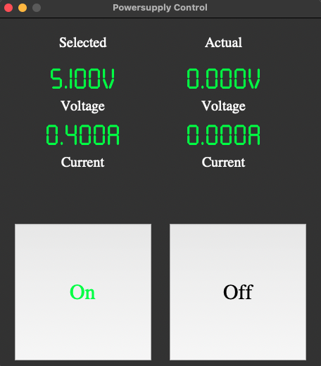

# SPD_Remote
Quick+Dirty remote control for ethernet connected SPD power supplies.
Only tested with my SPD1305X. Your mileage may vary. Don't blow things up with this, please don't blame me if you do.



# Usage:

Install dependencies:
```
pip install -r requirements.txt
```

Edit power_supply.py, change supplyIP to the address of your power supply.

Run with python 3.

```
python3 power_supply.py
```

Enjoy a basic remote GUI for your power supply.


# Credits:

LED font from:
https://www.dafont.com/seven-segment.font
If you use this program commercially, please buy the font.